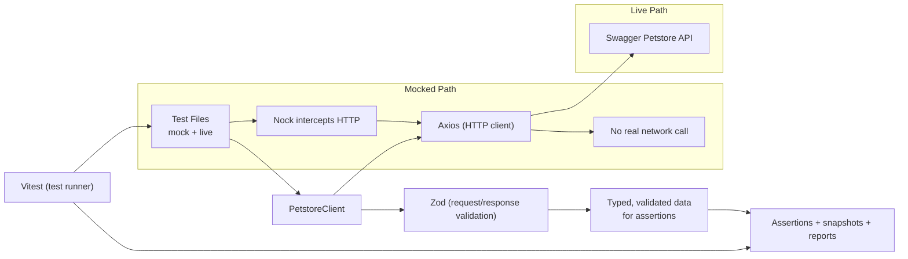

# API Automation Demo (TypeScript + Swagger Petstore)
[](https://github.com/deefex/api-automation-demo/actions/workflows/ci.yml)

A demo of API automation

## What this demonstrates

- API methods: `GET`, `POST`, and `DELETE` (cleanup)
- Request complexity: path params and nested JSON request bodies
- Response complexity: nested objects + arrays
- Advanced verification:
  - Typed schema validation using `zod` (deserialization-style checks)
  - Full-response snapshot verification (approval testing style)
- Builder pattern for reusable and maintainable test data setup
- Negative-path checks for invalid payloads and missing resources
- Mocking strategy using `nock` for deterministic API tests

## Tech stack

- TypeScript
- Vitest
- Axios
- Zod
- Nock

## The architecture jigsaw
This is a conceptual view of how everything hangs together



- `Vitest` runs the suite and performs assertions/snapshot checks.
- `PetstoreClient` is the thin abstraction your tests call.
- `Axios` performs HTTP requests.
- `Zod` validates request and response payloads at runtime while keeping TypeScript types aligned.
- `Nock` is used only for mock tests to intercept HTTP and avoid external dependencies.

## Project structure

```text
src/
  client/
    petstoreClient.ts
  config/
    env.ts
  models/
    pet.ts
tests/
  builders/
    petBuilder.ts
  live/
    petstore.live.test.ts
    setup.ts
  mock/
    petstore.mock.test.ts
    setup.ts
.github/workflows/
  ci.yml
```

## Quick start

1. Install dependencies

```bash
npm install
```

2. Run deterministic mocked tests (recommended default)

```bash
npm run test:mock
```

3. Run live Petstore tests

```bash
npm run test:live
```

## Environment

Copy `.env.example` to `.env` if you want to override the default API base URL.

```env
PETSTORE_BASE_URL=https://petstore.swagger.io/v2
```

## Notes

- `npm run test:mock` runs only mock tests to keep CI stable and fast.
- Live tests are intentionally separate because public API data/state can be unstable.
